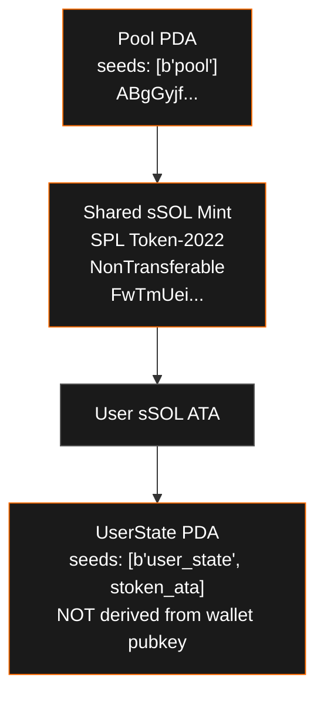
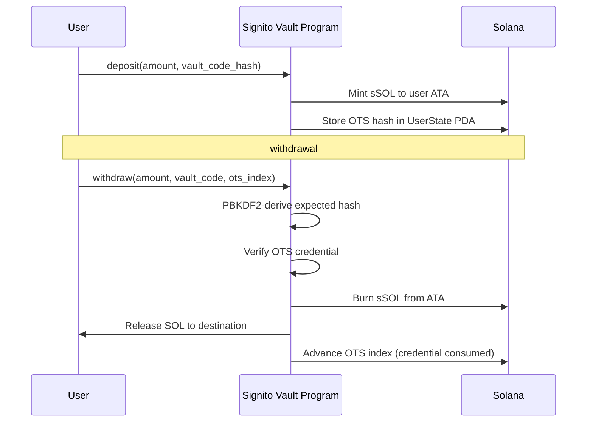
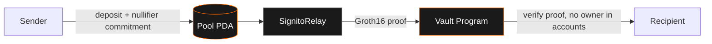
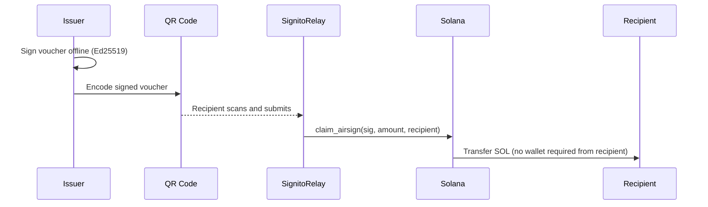

# signito-vault

Core on-chain Rust program for the [Signito](https://signito.org) protocol on Solana.

| | |
|---|---|
| Program ID | `CZBvErdLT8HL2iJS9NrRn7PhdeFWKNcMmvweEPsSbAAX` |
| Network | Solana Mainnet |
| Token Standard | SPL Token-2022 with NonTransferable extension |
| Upgrade Authority | `BNzyXaTXopiCCffJ6Ee7XCvPiXwVxEVThteN8S7kBMge` |

---

## Overview

Signito is a non-custodial transaction privacy protocol on Solana. This repository contains the core vault program implementing three on-chain privacy primitives:

| Feature | Description |
|---|---|
| **SafeVault** | OTS protocol vault: PBKDF2-derived hash chains, each withdrawal consumes one credential. A compromised private key alone cannot drain funds. |
| **StealthSend** | ZK privacy pool using Groth16 proofs (snarkjs). The owner wallet does not appear in withdrawal instruction accounts. |
| **AirSign** | Offline Ed25519 voucher signing with QR code delivery. Recipient claims funds without a wallet connection. |

---

## Architecture

### Account Model



> The UserState PDA is derived from the sSOL token account address, not the wallet pubkey. This severs the on-chain link between a user's identity and their vault activity.

---

### SafeVault: OTS Protocol



Each vault code is a PBKDF2-derived hash chain. Every withdrawal advances the index, making each credential one-time-use. A stolen private key without the vault code cannot drain funds.

---

### StealthSend: ZK Privacy Pool



The `private_send` instruction contains no owner wallet in its accounts list. The relayer broadcasts the withdrawal transaction on behalf of the recipient. On-chain, sender and recipient are unlinked.

---

### AirSign: Offline Vouchers



Vouchers are signed offline with Ed25519. The recipient only needs to scan a QR code. The relayer pays the transaction fee and submits the claim on-chain.

---

## On-Chain Addresses

| Account | Address |
|---|---|
| Program | `CZBvErdLT8HL2iJS9NrRn7PhdeFWKNcMmvweEPsSbAAX` |
| Pool PDA | `ABgGyjfdqKQxq5d9T2UK78QUemf1RmQTYthRJkKSAm6H` |
| sSOL Mint | `FwTmUeiXqXRPDnfcDSKQ9q6sjtcSTTqkSCVzTMJgZkNe` |
| Upgrade Authority | `BNzyXaTXopiCCffJ6Ee7XCvPiXwVxEVThteN8S7kBMge` |

---

## Security

This program includes an on-chain [`security.txt`](https://github.com/neodyme-labs/solana-security-txt) record:

```
name:                Signito
project_url:         https://signito.org
contacts:            email:security@signito.org
policy:              https://signito.org/docs/security
preferred_languages: en, ru
source_code:         https://github.com/signitoprivacy/signito-vault
```

To report a vulnerability, email **security@signito.org** or follow the responsible disclosure policy at [signito.org/docs/security](https://signito.org/docs/security).

---

## Build

Requires Solana platform tools v1.52 or later.

```bash
cargo build-sbf
```

To reproduce the exact deployed binary:

```bash
export PLATFORM_TOOLS="$HOME/.cache/solana/v1.52/platform-tools"
export PATH="$PLATFORM_TOOLS/rust/bin:$PLATFORM_TOOLS/llvm/bin:$PATH"
cargo build --target sbf-solana-solana --release
llvm-objcopy --strip-all \
  target/sbf-solana-solana/release/signito_vault.so \
  target/deploy/signito_vault.so
```

---

## License

MIT
